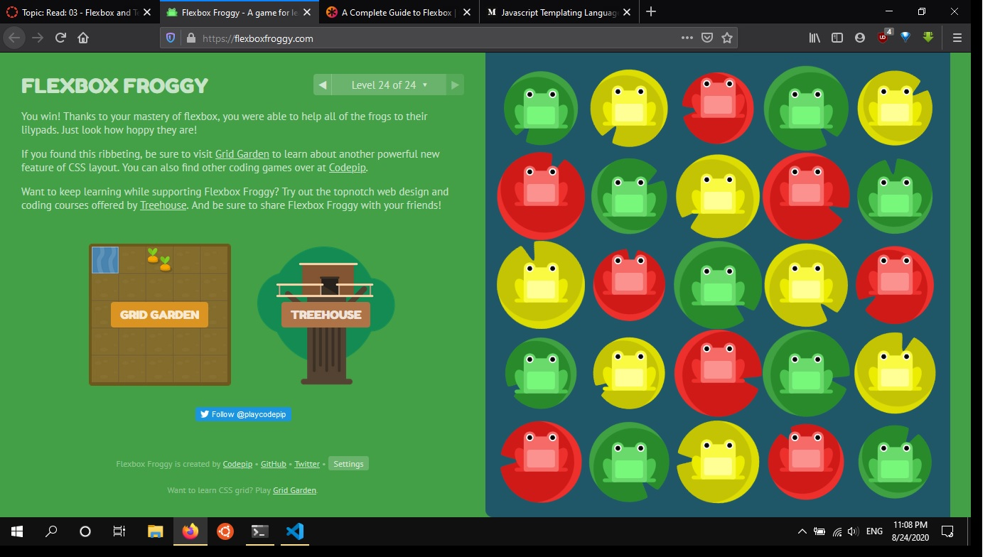

# Flexbox and Templating.

[Home](https://sayefdeen.github.io/reading-notes301/)

## Javascript Templating

Javascript templating is a fast and efficient technique to render client-side view templates with Javascript by using a JSON data source. The template is HTML markup, with added templating tags that will either insert variables or run programming logic.

Mustache is a logic-less template syntax. It can be used for HTML, config files, source code — anything. It works by expanding tags in a template using values provided in a hash or object, it is often referred to as **logic-less** because there are no if statments, else clauses, or for loops.

```javascript
Mustache.render(“Hello, {{name}}”, { name: “Sherlynn” });
// returns: Hello, Sherlynn
```

In the above, we see two braces around {{ name }}. This is Mustache syntax to show that it is a placeholder. When Mustache compiles this, it will look for the ‘name’ property in the object we pass in, and replace {{ name }} with the actual value, e,g, “Sherlynn”.

## Mustache-Express

        $ npm install mustache --save

Configure mustache-express in your server.js/app.js/index.js file:

```javascript
var mustacheExpress = require("mustache-express");

app.engine("html", mustacheExpress());
app.set("view engine", "html");
app.set("views", __dirname + "/src/views");
```

---

## Flexbox

There is properties for the Parent (flex container),and for the Children (flex items).

## 1. Parent (flex container) :

- dispaly : This defines a flex container; inline or block depending on the given value. It enables a flex context for all its direct children.

```css
.container {
  display: flex;
}
```

- flex-direction: This destablishes the main axis.
  - **row (default)**: left to right in ltr; right to left in rtl
  - **row-reverse**: right to left in ltr; left to right in rtl
  - **column**: same as row but top to bottom
  - **column-reverse**: same as row-reverse but bottom to top

```css
.container {
  flex-direction: row | row-reverse | column | column-reverse;
}
```

- flex-wrap : By default, flex items will all try to fit onto one line. You can change that and allow the items to wrap as needed with this property.
  - **nowrap** (default): all flex items will be on one line
  - **wrap**: flex items will wrap onto multiple lines, from top to bottom
  - **wrap-reverse**: flex items will wrap onto multiple lines from bottom to top.

```css
.container {
  flex-wrap: nowrap | wrap | wrap-reverse;
}
```

- **flex-flow** : This is a shorthand for the `flex-direction` and `flex-wrap` properties, which together define the flex container’s main and cross axes. The default value is row nowrap.

- **justify-content** : This defines the alignment along the main axis. It helps distribute extra free space leftover when either all the flex items on a line are inflexible, or are flexible but have reached their maximum size

  - **flex-start** (default): items are packed toward the start of the flex-direction.

  - **flex-end**: items are packed toward the end of the flex-direction.

  - **start**: items are packed toward the start of the writing-mode direction.

  - **end**: items are packed toward the end of the writing-mode direction.

  - **left**: items are packed toward left edge of the container, unless that doesn’t make sense with the flex-direction, then it behaves like start.

  - **right**: items are packed toward right edge of the container, unless that doesn’t make sense with the flex-direction, then it behaves like start.

  - **center**: items are centered along the line

  - **space-between**: items are evenly distributed in the line; first item is on the start line, last item on the end line

  - **space-around**: items are evenly distributed in the line with equal space around them.

  - **space-evenly**: items are distributed so that the spacing between any two items (and the space to the edges) is equal.

- **align-items** : This defines the default behavior for how flex items are laid out along the cross axis on the current line. Think of it as the justify-content version for the cross-axis (perpendicular to the main-axis).

  - **stretch** (default): stretch to fill the container (still respect min-width/max-width)

    - **flex-start** / **start** / **self-start**: items are placed at the start of the cross axis. The difference between these is subtle, and is about respecting the flex-direction rules or the writing-mode rules.

    - **flex-end** / **end** / **self-end**: items are placed at the end of the cross axis. The difference again is subtle and is about respecting flex-direction rules vs. writing-mode rules.

    - **center**: items are centered in the cross-axis

    - **baseline**: items are aligned such as their baselines align

## 2. Children (flex items) :

- **order**: By default, flex items are laid out in the source order. However, the order property controls the order in which they appear in the flex container.

- **flex-gorw** : This defines the ability for a flex item to grow if necessary. It accepts a unitless value that serves as a proportion. It dictates what amount of the available space inside the flex container the item should take up.

- **flex-shrink **: This defines the ability for a flex item to shrink if necessary.

- **flex-basis** : This defines the default size of an element before the remaining space is distributed

- **flex** : This is the shorthand for `flex-grow`, `flex-shrink` and `flex-basis` combined. The second and third parameters (`flex-shrink` and `flex-basis`) are optional. The default is 0 1 auto, but if you set it with a single number value, it’s like 1 0.

- **align-items** : This allows the default alignment (or the one specified by align-items) to be overridden for individual flex items.

---

## Flexbox Froggy


